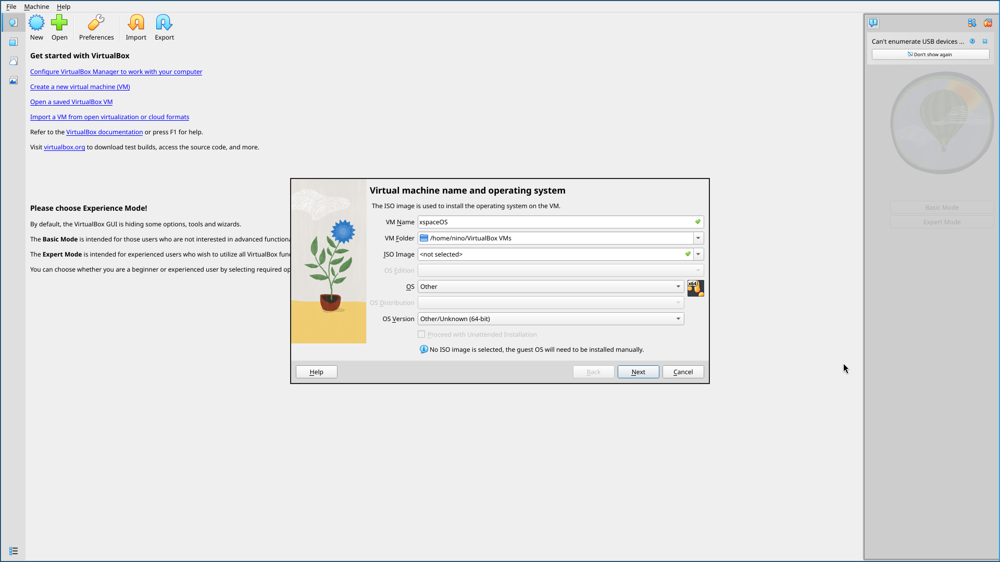
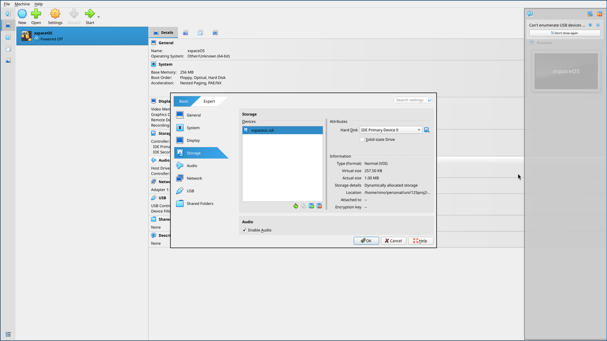
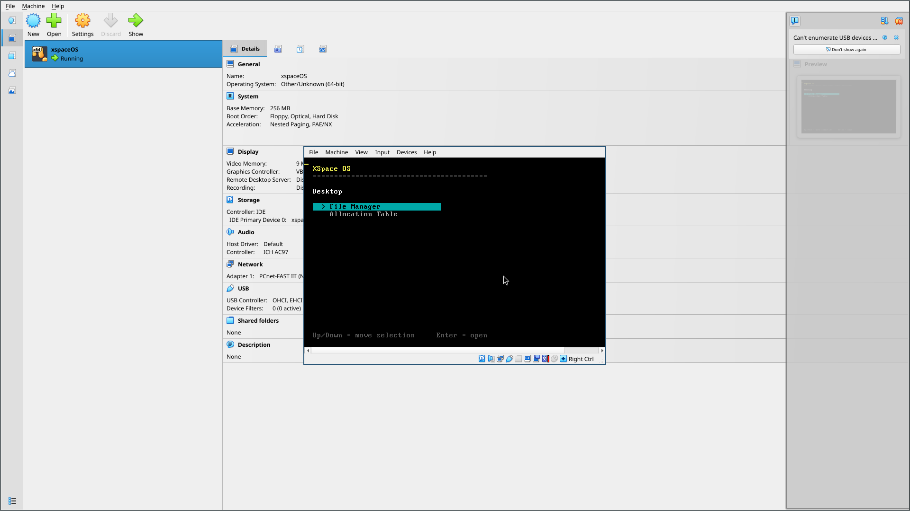
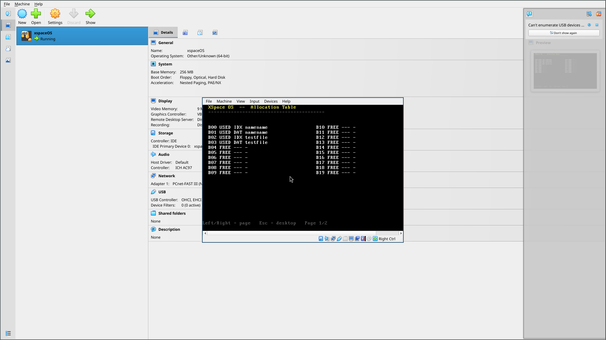

# XSpace OS User Manual

**By Whitexpace**

**Members:**

- Guarin, Nicolete Rein
- Legaspo, Jed Lordy
- Pagaran, Niño Christian
- Solis, Glen

<!-- pagebreak -->

## Table of Contents

- [I. Introduction and Scope](#i-introduction-and-scope)
- [II. Requirements and Project Setup](#ii-requirements-and-project-setup)
- [III. Build and Boot Procedures](#iii-build-and-boot-procedures)
- [IV. Desktop and Application Navigation](#iv-desktop-and-application-navigation)
- [V. File Editing Workflow](#v-file-editing-workflow)
- [VI. Allocation Table and File System Model](#vi-allocation-table-and-file-system-model)
- [VII. Keyboard Reference](#vii-keyboard-reference)
- [VIII. Troubleshooting](#viii-troubleshooting)
- [IX. Demonstration Flow](#ix-demonstration-flow)

<!-- pagebreak -->

## I. Introduction and Scope

XSpace OS is a small Rust operating system kernel that boots directly in a
virtual machine. It uses VGA text mode for screen output and a polled PS/2
keyboard driver for input.

This manual describes the features implemented in the current repository. The
details were checked against `src/main.rs`, `src/shell.rs`, `src/keyboard.rs`,
`src/fs.rs`, `.cargo/config.toml`, and `scripts/build-virtualbox-disk.sh`.

Important: the current file system is stored in RAM only. Files are lost when
the virtual machine is restarted, reset, or powered off.

### Current Capabilities

The current build includes:

- a keyboard-driven desktop
- a `File Manager` app
- an `Allocation Table` app
- text file creation
- text file opening and editing
- file saving through `Ctrl+S`
- file renaming through `Ctrl+R`
- file deletion from the file manager
- cursor movement inside the editor
- Caps Lock and Shift support for text entry
- a simulated indexed-allocation file system

### Current Boundaries

The current build does not include:

- persistent disk storage for user-created files
- mouse support
- multitasking
- a graphical window system
- an installer ISO

## II. Requirements and Project Setup

### Host Tools

Install these tools on the host computer before building the OS:

- Rust and Cargo through `rustup`
- a nightly Rust toolchain
- the `rust-src` component
- the `llvm-tools-preview` component
- `bootimage`
- QEMU tools
- VirtualBox, if the generated VDI will be run in VirtualBox

Check the installed tools with:

```sh
rustup --version
cargo --version
qemu-img --version
VBoxManage --version
```

### Rust Toolchain Setup

Run this setup once from the project root:

```sh
rustup toolchain install nightly
rustup override set nightly
rustup component add rust-src llvm-tools-preview
cargo install bootimage
```

This project requires nightly Rust because `.cargo/config.toml` uses a custom
bare-metal target and `build-std`.

### Project Root

Use the project root folder, meaning the folder that contains `Cargo.toml`,
`Cargo.lock`, `src/`, `docs/`, and `scripts/`.

Move into that folder before running build commands:

```sh
cd path/to/xspaceos
```

Replace `path/to/xspaceos` with the actual project location on the computer
being used.

## III. Build and Boot Procedures

### Build the Kernel

To compile the kernel:

```sh
cargo build
```

To create the bootable raw disk image:

```sh
cargo bootimage
```

The raw image is created at:

```text
target/x86_64-xspaceos/debug/bootimage-xspaceos.bin
```

### Build the VirtualBox Disk

To create the VirtualBox disk image, use the helper script:

```sh
./scripts/build-virtualbox-disk.sh
```

The script runs `cargo bootimage`, then converts the raw image into:

```text
xspaceos.vdi
```

### Run with QEMU

QEMU is the reference environment for this project.

From the project root, run:

```sh
cargo run
```

Cargo uses the configured `bootimage runner`, which starts QEMU with the
generated boot image.

Manual QEMU command:

```sh
qemu-system-x86_64 -drive format=raw,file=target/x86_64-xspaceos/debug/bootimage-xspaceos.bin
```

### Create the VirtualBox Machine

XSpace OS does not use an ISO installer. In VirtualBox, boot from the generated
`xspaceos.vdi` disk instead.

1. Open VirtualBox.
2. Click `New`.
3. Use a VM name such as `XSpace OS`.
4. Leave the ISO image field empty.
5. Set `OS` to `Other`.
6. Set `OS Version` to `Other/Unknown (64-bit)`.
7. Continue to the hardware screen.



Caption: Create the VM without an ISO image and use an `Other/Unknown (64-bit)`
guest type.

### Configure Virtual Hardware

Recommended VM settings:

- Base Memory: `128 MB` minimum; `256 MB` is fine
- CPUs: `1`
- EFI: disabled
- Boot mode: legacy BIOS


Caption: Keep `Use EFI` unchecked. The current boot image expects legacy BIOS
boot.

VirtualBox may ask for a virtual hard disk size during VM creation. It is fine
to finish the wizard, because the generated `xspaceos.vdi` will be attached in
the next step.

### Attach `xspaceos.vdi`

After building the VDI with `./scripts/build-virtualbox-disk.sh`:

1. Select the VM in VirtualBox.
2. Open `Settings`.
3. Open `Storage`.
4. Remove any temporary blank disk if VirtualBox created one.
5. Attach `xspaceos.vdi` as the VM hard disk.
6. Save the settings.



Caption: Attach the generated `xspaceos.vdi` file as the VM's hard disk.

### Boot the OS

Start the VM. A successful boot shows the XSpace OS desktop.



Caption: The desktop shows the `File Manager` and `Allocation Table` apps.

## IV. Desktop and Application Navigation

### Desktop Screen

The desktop is the first screen after boot.

Desktop controls:

| Key | Action |
| --- | --- |
| `Up` / `Down` | Move the highlighted selection. |
| `Enter` | Open the selected app. |

Available apps:

| App | Purpose |
| --- | --- |
| `File Manager` | Create, open, edit, rename, and delete files. |
| `Allocation Table` | Inspect simulated file allocation blocks. |

### File Manager Screen

Open `File Manager` from the desktop by leaving it highlighted and pressing
`Enter`.

The file manager shows:

- `[ + New File ]` at the top
- existing files below it
- each file's current size in bytes


Caption: The file manager lists files and shows each file's byte count.

File manager controls:

| Key | Action |
| --- | --- |
| `Up` / `Down` | Move the highlighted selection. |
| `Enter` on `[ + New File ]` | Start creating a new file. |
| `Enter` on a file | Open that file in the editor. |
| `Delete` on a file | Delete the selected file immediately. |
| `Esc` | Return to the desktop. |

There is no confirmation prompt before deleting a file. Because the file system
is currently in memory only, deleted files cannot be recovered.

## V. File Editing Workflow

### Create a File

1. Open `File Manager`.
2. Highlight `[ + New File ]`.
3. Press `Enter`.
4. Type the file name at the `File name:` prompt.
5. Press `Enter`.

If the name is accepted, the editor opens automatically for the new file.

File name rules:

- the name cannot be empty
- the name cannot be longer than `32` bytes
- the name cannot match an existing file

The OS reports an error if the file table is full or the name already exists.
If an empty name is entered, the OS returns to the file manager without
creating a file.

### Open a File

1. Open `File Manager`.
2. Highlight the file name.
3. Press `Enter`.

There is no separate read-only viewer. Files are opened in the editor.

### Edit Text

The editor is a full-screen text editor. It shows:

- the current file name in the top bar
- editor shortcuts in the top bar
- file contents in the main area
- saved/unsaved status in the bottom bar
- current size out of the `512` byte limit
- `CAPS` in the bottom bar when Caps Lock is enabled


Caption: The editor supports typing, cursor movement, deletion, saving,
closing, and renaming.

Editor controls:

| Key | Action |
| --- | --- |
| Printable keys | Insert text at the cursor. |
| `Enter` | Insert a newline. |
| `Backspace` | Delete the character before the cursor. |
| `Delete` | Delete the character at the cursor. |
| `Left` / `Right` | Move the cursor one character left or right. |
| `Up` / `Down` | Move through visual editor rows. |
| `Home` | Move to the start of the current visual row. |
| `End` | Move to the end of the current visual row. |
| `PageUp` / `PageDown` | Move up or down by one visible editor page. |
| `Ctrl+S` | Save the file. |
| `Ctrl+R` | Rename the file. |
| `Ctrl+X` | Close the editor and return to the file manager. |

Save before closing. `Ctrl+X` does not ask whether unsaved changes should be
kept.

### Save a File

Press `Ctrl+S` inside the editor.

When saving succeeds, the bottom status bar changes to `Saved`. Editing after
that changes the status back to `Unsaved`.

The editor stops accepting more text after the file reaches `512` bytes.

### Rename a File

1. Open the file in the editor.
2. Press `Ctrl+R`.
3. Type the new name at the `New name:` prompt.
4. Press `Enter`.


Caption: Renaming is done from inside the editor.

Rename rules:

- the new name cannot be empty
- the new name cannot be longer than `32` bytes
- the new name cannot match an existing file

Renaming changes only the file name. It does not change the file contents or
the file's allocated data blocks.

### Delete a File

1. Open `File Manager`.
2. Highlight the file.
3. Press `Delete`.

The selected file is removed immediately. Its index block and data blocks are
returned to the free block pool.

## VI. Allocation Table and File System Model

### Allocation Table Screen

Open `Allocation Table` from the desktop to inspect the simulated file
allocation state.

The table displays block entries in two columns. Each row contains:

- block number, such as `B00`
- state: `USED` or `FREE`
- block type: `IDX`, `DAT`, or `---`
- owner file name, if the block is used



Caption: A file uses one `IDX` block and one or more `DAT` blocks after content
is saved.

Allocation table controls:

| Key | Action |
| --- | --- |
| `Left` / `Right` | Move between allocation-table pages. |
| `Esc` | Return to the desktop. |

The current file system has `40` simulated blocks, so the allocation table has
two pages of `20` blocks each.

### Indexed Allocation Model

XSpace OS currently uses a fixed-size, in-memory file system. It is designed
for a small `no_std` kernel, so it does not require heap allocation.

Storage model:

- files are kept in kernel RAM
- each file reserves one index block when created
- file contents are split into `128` byte data blocks when saved
- each file can own up to four data blocks
- deleting a file frees its index block and data blocks
- saving a file replaces its previous data-block allocation

After deleting a file, its blocks become `FREE` again:


### File System Limits

Current limits:

| Limit | Value |
| --- | --- |
| Maximum files | `8` |
| Maximum file name length | `32` bytes |
| Maximum file content length | `512` bytes |
| Block size | `128` bytes |
| Maximum data blocks per file | `4` |
| Index blocks per file | `1` |
| Total simulated blocks | `40` |
| Persistence | None; RAM only |

What this means for users:

- Empty files still use one index block.
- A saved file with 1 to 128 bytes uses one data block.
- A saved file with 129 to 256 bytes uses two data blocks.
- A saved file with 257 to 384 bytes uses three data blocks.
- A saved file with 385 to 512 bytes uses four data blocks.
- Files disappear after reboot or power off.

## VII. Keyboard Reference

Text input supports standard US keyboard scancode set 1 behavior for the keys
implemented by the current driver.

Supported behavior:

- letters, numbers, spaces, and common punctuation
- `Shift` for uppercase letters
- `Caps Lock` for alphabetic capitalization
- `Shift` with the number row, such as `!`, `@`, `#`, `$`, `%`, `^`, `&`, `*`,
  `(`, and `)`
- `Shift` with punctuation, such as `_`, `+`, `{`, `}`, `|`, `:`, `"`, `~`,
  `<`, `>`, and `?`
- left and right arrow keys
- `Home`, `End`, `PageUp`, `PageDown`
- `Backspace`, `Delete`, `Enter`, and `Esc`
- `Ctrl+S`, `Ctrl+R`, and `Ctrl+X` in the editor

Notes:

- Caps Lock affects letters only.
- Holding Shift while Caps Lock is active types lowercase letters.
- Unsupported key combinations are ignored.
- The OS does not use mouse input.

## VIII. Troubleshooting

### `cargo build` reports `build-std` or target errors

Make sure nightly Rust is active and the required components are installed:

```sh
rustup override set nightly
rustup component add rust-src llvm-tools-preview
```

### `cargo bootimage` is not found

Install `bootimage`:

```sh
cargo install bootimage
```

### `qemu-img` is not found

Install QEMU tools, then verify:

```sh
qemu-img --version
```

### VirtualBox asks for an ISO

Do not select an ISO. XSpace OS boots from `xspaceos.vdi`.

Use this process:

1. Create the VM without installation media.
2. Finish the VM wizard.
3. Open `Settings > Storage`.
4. Attach `xspaceos.vdi` as the hard disk.

### VirtualBox does not boot the OS

Check the following:

- `xspaceos.vdi` exists in the project root
- the VDI was rebuilt after the latest code changes
- the VDI is attached as the VM hard disk
- EFI is disabled
- the VM type is a 64-bit `Other/Unknown` style guest
- the raw image boots with QEMU

If QEMU boots but VirtualBox does not, use QEMU for the demo. QEMU is the
reference platform for this project.

### Files disappear after restarting

This is expected in the current implementation. The file system is in memory
only and does not write user files to the VDI.

## IX. Demonstration Flow

Use this short flow for a clean demonstration:

1. Build the VDI with `./scripts/build-virtualbox-disk.sh`.
2. Start the VirtualBox VM.
3. Open `File Manager`.
4. Create a file named `notes.txt`.
5. Type:

```text
XSpace OS demo file
Created inside the OS editor
Files are currently RAM-only
```

6. Press `Ctrl+S` to save.
7. Press `Ctrl+R` and rename the file to `manual.txt`.
8. Press `Ctrl+X` to return to the file manager.
9. Confirm the renamed file appears with its byte count.
10. Press `Esc` to return to the desktop.
11. Open `Allocation Table`.
12. Show the `IDX` block and `DAT` block entries for the file.

This demonstrates booting, file management, editing, saving, renaming, and
indexed allocation inspection.
